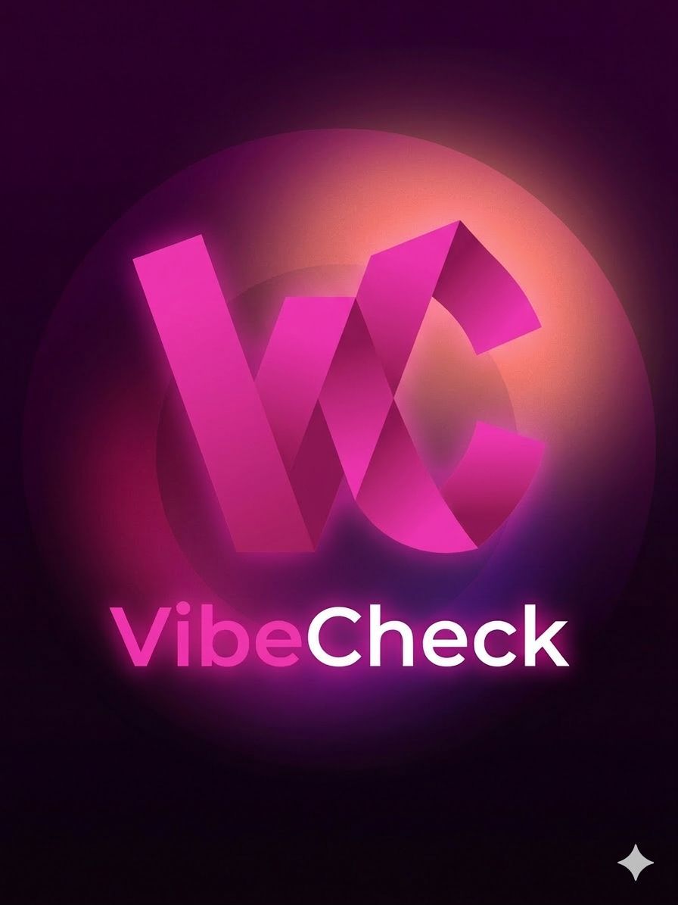
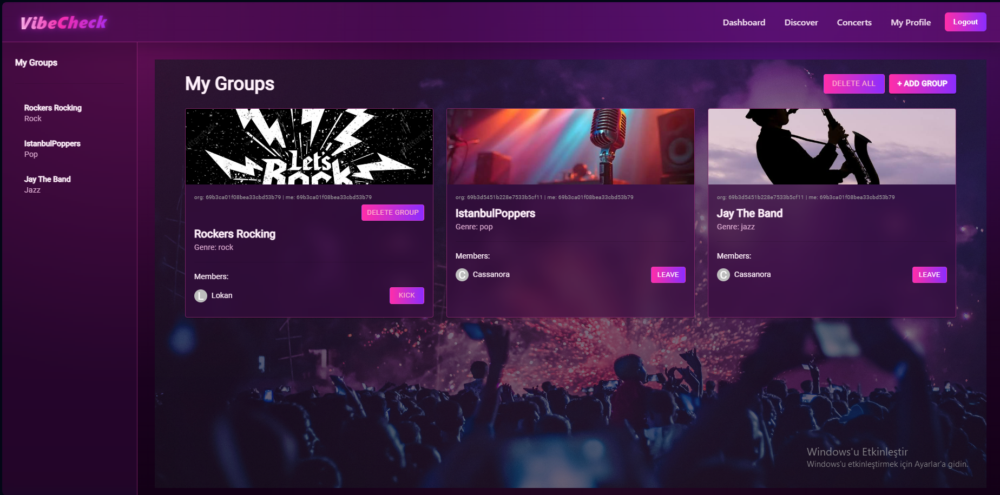

# VibeCheck Frontend

React + Vite frontend for VibeCheck.

## Live URLs
- Frontend App: https://vibecheck-sigma-virid.vercel.app
- Backend API: https://vibecheck-server.vercel.app

## Scripts
- `npm run dev` — start development server
- `npm run build` — create production build
- `npm run preview` — preview production build locally

## Environment Variable
Create `.env.local` with:

```env
VITE_SERVER_URL=https://vibecheck-server.vercel.app
```

## Screenshots

### Logo


### Send Screen

